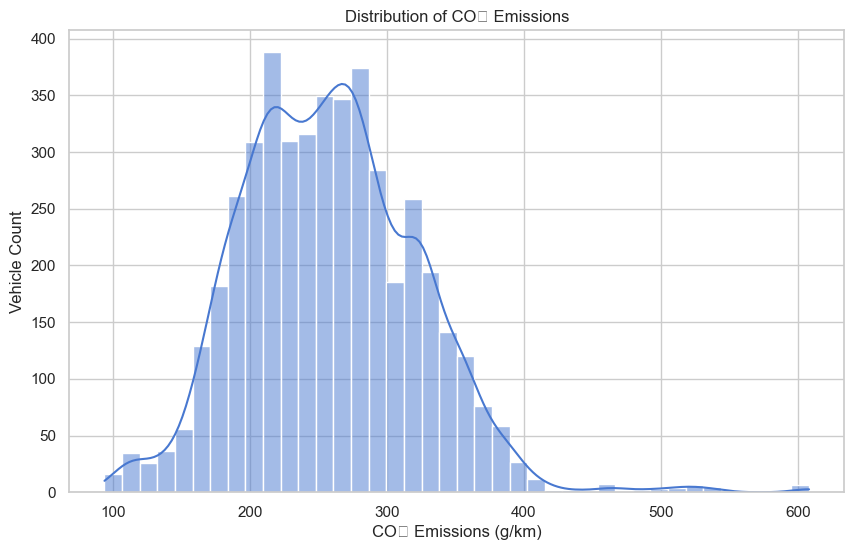
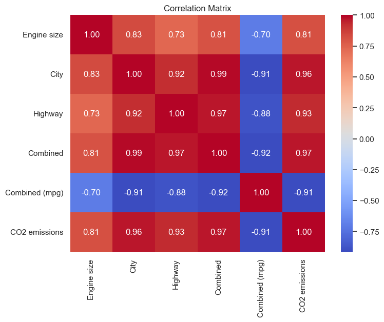

# 🌿 Green Fleet AI Predictor

**Strategic AI Solution for Sustainable Government Fleet Procurement**

---

## Business Challenge

A government agency must renew its vehicle fleet while staying under strict environmental carbon limits. Failure to comply results in severe legal penalties.

The goal of this project is to build an AI-driven predictive system capable of estimating the **CO₂ emissions of new vehicle models before procurement**, ensuring full regulatory compliance.

---

## Exploratory Data Analysis

### CO₂ Emissions Distribution

Understanding how emissions are distributed across the dataset helps identify typical emission ranges and potential outliers.

This visualization shows that most vehicles fall within a moderate emissions range, while a smaller group of high-emission vehicles appears as a right-side tail.

---

### Feature Correlation Analysis

To build an accurate prediction model, it is important to understand how variables relate to each other.

Key insights from the correlation matrix:

- **City fuel consumption** strongly correlates with CO₂ emissions.
- **Combined MPG** shows a strong negative correlation with emissions.
- Engine size also contributes significantly to emission levels.

These relationships guided the feature selection process for the predictive model.

---

## Tech Stack & Skills Demonstrated

- **Language:** Python  
- **Libraries:** Pandas, NumPy, Matplotlib, Seaborn, SciPy, Statsmodels  

### Analytical Techniques
- Exploratory Data Analysis (EDA)
- Hypothesis Testing (Welch's T-test)
- Feature Selection
- Simple Linear Regression
- Multiple Linear Regression
- Multicollinearity handling (Dummy Variable Trap)

---

## Project Pipeline

1. **Statistical Trial**

A Welch's T-test confirmed that compact vehicles produce statistically lower CO₂ emissions than mid-size vehicles.

2. **Strategic Feature Selection**

City fuel consumption was prioritized due to the agency’s urban operational environment.

3. **Multivariate AI Modeling**

A Multiple Linear Regression model was trained using engineered categorical variables.

**Model Performance**
